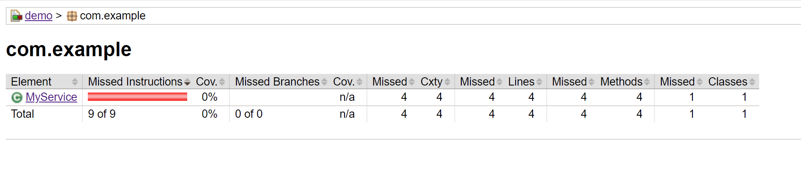
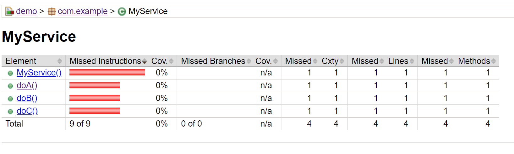

# Setup

```bash
./mvnw test
./mvnw jacoco:report
```

Open target/site/jacoco/index.html

# Results

Java, as expected, reports a 0% coverage:



When looking at the details, we can also see 0% for any of `MyService` methods (as expected):

