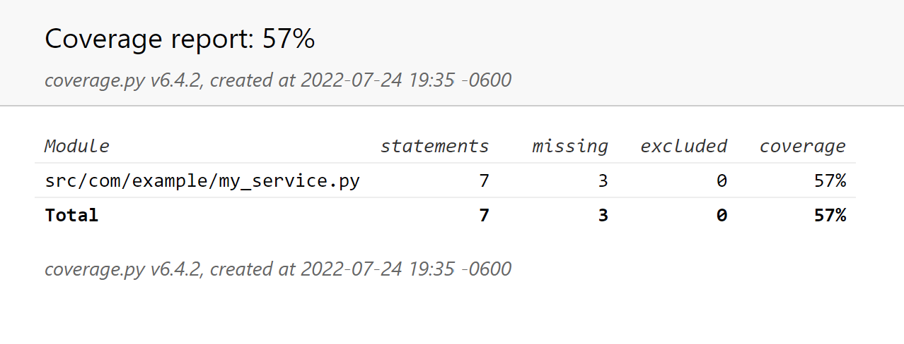
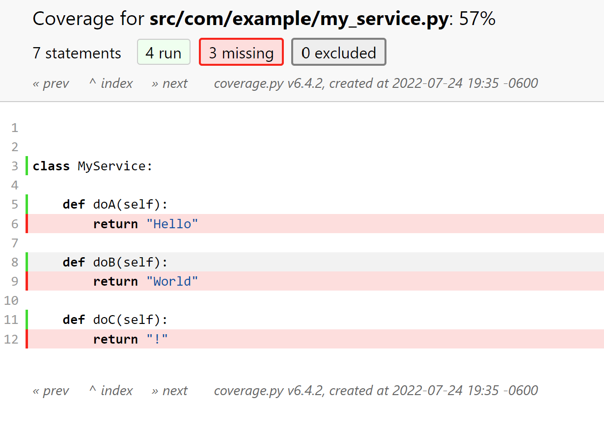

# Setup

```bash
python3 -m venv .venv
. .venv/bin/activate
python3 -m pip install --upgrade pip
python3 -m pip install --upgrade pip
python3 -m pip install -r requirements.txt
```


Run tests:

```bash
. .env
./run.sh unittest
./run.sh report
```

Open `htmlcov/index.html`.

# Results

This is what `coverage` reports after excluding `from`s and `import`s:



And this is the details of my_service test coverage results:



The strangeness here is that `def` lines are taken into account and yet it's not possible (to my knowledge) to exclude those without excluding their body.
It simply doesn't make sense to me here that Python Coverage would report a 57% coverage while no method was actually called.

It's also interesting (in a bad way) that Python Coverage would include `import`/`from` by default. It's like saying Java JaCoCo would include `import`s and `package`s in tests (it doesn't).