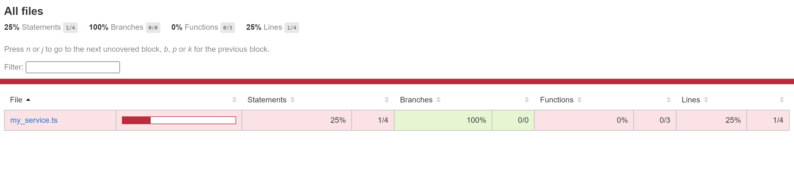
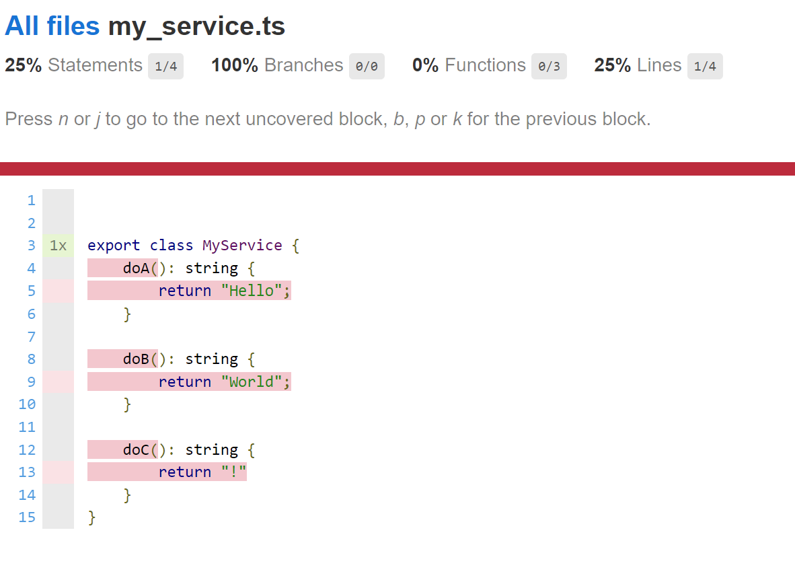

# Setup

```bash
nvm use --lts
npm install
npm run test
```

Open [coverage/index.html](coverage/index.html).

# Results

Results are interesting with `nyc` with TypeScript.
When the test is simply:

```ts
describe("my_service", (): void => {

    it("doA", ():void => {
        console.log('Not doing it');
    })
});
```

The result is simply nothing:


Now if we change the test slighty by instantiating the class:

```ts
//import { MyService } from "@example/my_service";

describe("my_service", (): void => {

    it("doA", ():void => {
        new MyService();
        console.log('Not doing it');
    })
});
```

Then we get 0% (for functions) as expected:



And the details corroborate this:



